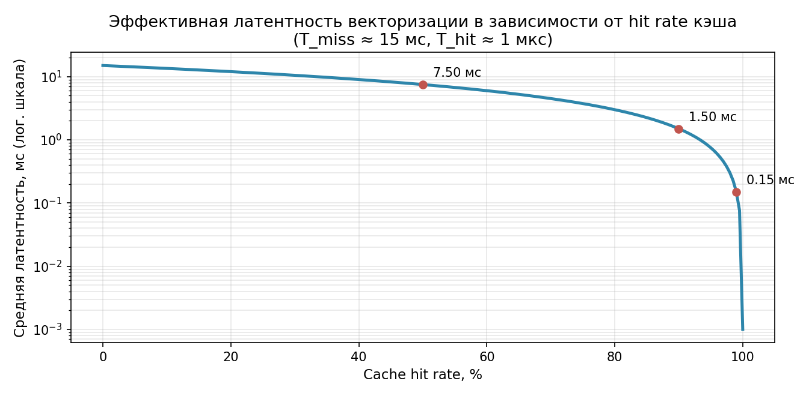
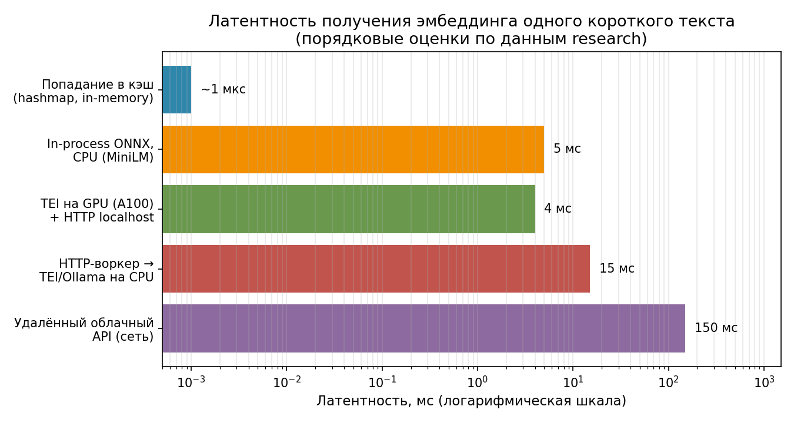
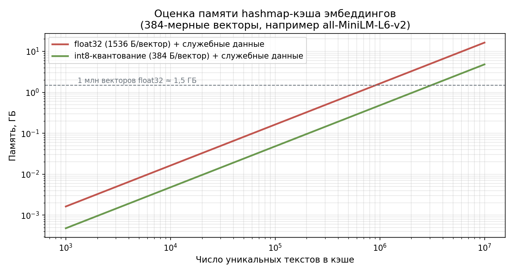

# Research v2: векторизация текста для ModelWorker — разбор каждого варианта с плюсами и минусами

**Задача:** выбор архитектуры векторизации текста до начала реализации
**Статус:** вариант документа №2 — «карточный» разбор; дополняет
[text-vectorization-research.md](text-vectorization-research.md) (вариант №1,
где сравнение построено на сводных таблицах)

> Отличие от варианта №1: здесь **каждый** рассмотренный вариант оформлен
> отдельной карточкой с единой структурой — *Описание → Как работает →
> Плюсы → Минусы → Когда выбирать → Вердикт*. Числовые оценки и источники
> общие с вариантом №1; итоговая рекомендация не изменилась.

---

## Часть 1. Когда векторизовать

### 1.1. Вариант А — предварительная векторизация с сохранением

**Описание.** Все тексты векторизуются заранее (при загрузке корпуса или
отдельной batch-задачей), векторы сохраняются, ModelWorker при вызове только
читает готовый вектор.

**Как работает.** Offline-пайплайн прогоняет корпус через embedding-модель
батчами (десятки–сотни текстов за один проход почти без роста латентности на
текст[^13^]), складывает векторы в хранилище; онлайн-путь — чтение из
памяти/диска. Это общепринятая практика поисковых систем: документы эмбедят
офлайн, онлайн оставляют только эмбеддинг запроса[^11^].

**Плюсы:**

- минимальная и предсказуемая латентность вызова (~мкс–мс — чтение, а не инференс);
- тяжёлый инференс выполняется один раз и амортизируется по всем последующим вызовам[^12^];
- массовая векторизация эффективно использует GPU (батчинг);
- работает даже при недоступном embedding-сервисе — векторы уже посчитаны;
- 1 млн коротких текстов — это ~1,4 ч на 24-ядерном CPU или ~5–6 мин на RTX 2080[^1^]: предвычислить можно практически любой реалистичный корпус.

**Минусы:**

- нужен контур хранения и синхронизации векторов (где лежат, кто обновляет, как версионируются);
- векторы устаревают при изменении корпуса или смене модели — а векторы разных моделей несравнимы, смена модели = полная переиндексация[^14^];
- не покрывает динамические тексты (пользовательский ввод, свежие документы) — их предвычислить невозможно в принципе;
- требует отдельного batch-контура (скрипты, расписание, мониторинг), которого в SADER пока нет.

**Когда выбирать.** Статичный, заранее известный корпус (эталонные тексты
для классификации, фиксированная база знаний), жёсткие требования к p99
латентности.

**Вердикт.** Не основной путь, а поддерживаемый режим: реализуется как
прогрев кэша варианта 1.3 без отдельного хранилища.

### 1.2. Вариант Б — векторизация при каждом вызове

**Описание.** Каждый вызов ModelWorker с текстом сам запрашивает эмбеддинг у
источника (сервис или локальный инференс), без какого-либо переиспользования
результатов.

**Как работает.** `текст → HTTP/инференс → вектор → normalize/cosine/classify`
на каждый вызов.

**Плюсы:**

- максимальная простота: нет хранилища, синхронизации, инвалидации;
- векторы всегда свежие и соответствуют текущей модели;
- одинаково работает для статичных и динамических текстов;
- минимальный объём кода для MVP.

**Минусы:**

- каждый вызов платит полную стоимость: инференс (единицы–десятки мс) плюс сетевой хоп (HTTP на localhost добавляет ~5–20 мс на round trip[^15^][^16^]);
- повтор одного и того же текста (типичный сценарий для `cosine`/`classify` с эталонами) сжигает ресурс впустую;
- полная неработоспособность при недоступности сервиса;
- стоимость растёт линейно с числом вызовов — для облачного API это прямые деньги, для self-hosted — занятый GPU/CPU.

**Когда выбирать.** Прототип, редкие разовые вызовы, тексты гарантированно
уникальны.

**Вердикт.** Недостаточен в чистом виде: профиль вызовов ModelWorker
(повторные сравнения с эталонами) делает повторный инференс доминирующей
статьёй затрат.

### 1.3. Вариант В — гибрид: векторизация при вызове + точный кэш

**Описание.** On-the-fly векторизация, но результат каждого текста
сохраняется в in-memory кэш; повторный текст обслуживается из кэша.

**Как работает.** `текст → кэш? → (hit: вектор за ~мкс) / (miss: инференс →
запись в кэш → вектор)`. Стоимость попадания и промаха различаются на ~4
порядка; при hit rate 90 % средняя латентность падает в 10 раз, при 99 % —
в ~100 раз (см. графики ниже).

**Плюсы:**

- сохраняет все достоинства варианта 1.2 (свежесть, универсальность, нет внешнего хранилища);
- повторные вызовы почти бесплатны — устраняет главный минус варианта 1.2;
- предвычисление (вариант 1.1) получается бесплатно — как прогрев того же кэша;
- кэш эмбеддингов корректен по построению: эмбеддинг — детерминированная функция (текст, модель), exact-match hit всегда валиден.

**Минусы:**

- память: 384-мерный float32-вектор — 1536 Б, миллион записей ≈ 1,5 ГБ (см. часть 3.5) — нужны лимит и вытеснение;
- выигрыш целиком зависит от реального hit rate — гипотеза, требующая замера на живых сценариях;
- дополнительная сложность: ключи, вытеснение, потокобезопасность, метрики;
- холодный старт: первый проход по корпусу идёт с полной стоимостью промахов.

**Когда выбирать.** Базовый режим для ModelWorker как capability общего
назначения.

**Вердикт.** ✅ **Выбран.** Это и есть итоговая архитектура; варианты 1.1 и
1.2 становятся её частными случаями (прогретый кэш / пустой кэш).

---

## Часть 2. Откуда брать эмбеддинг

### 2.1. Вариант В1 — эмбеддинг как API через HTTP-воркер

**Описание.** ModelWorker не знает про сеть: Executor оркестрирует цепочку
«HttpWorker → embedding-сервис → ModelWorker».

**Как работает.** Запрос разбивается на два вызова capability: `http`
выполняет POST к сервису (TEI/Ollama/OpenAI-совместимый endpoint), `model`
получает готовый вектор.

**Плюсы:**

- переиспользует существующую capability `HttpWorker` — ноль нового сетевого кода;
- чистое разделение ответственности: «сеть» и «математика» в разных воркерах;
- соответствует философии SADER «каждая операция — Worker» в буквальном прочтении.

**Минусы:**

- в интерфейсе `Worker` нет вызова воркера из воркера: оркестрацию цепочки придётся добавлять в `Executor`, а это прямо нарушает запрет на worker-specific логику в ядре;
- два сетевых/межпроцессных хопа вместо одного на каждый промах кэша;
- обработка ошибок (таймауты, ретраи, недоступность) размазывается по двум воркерам — сложнее диагностика;
- конфигурация embedding-сервиса (endpoint, модель) живёт вне ModelWorker — capability перестаёт быть самоописываемой.

**Когда выбирать.** Если политика проекта запрещает воркерам собственные
исходящие соединения, или embedding-сервис уже стандартизирован как
HTTP-capability для всей системы.

**Вердикт.** ❌ Отклонён как основной; оставлен как fallback-сценарий
интеграции.

### 2.2. Вариант В2 — embedding API внутри ModelWorker

**Описание.** ModelWorker сам содержит HTTP-клиент и обращается к
embedding-сервису по OpenAI-совместимому контракту `POST /v1/embeddings`
(поля `model`, `input`, `encoding_format`[^7^]); транспорт спрятан за
внутренним интерфейсом `EmbeddingBackend`.

**Как работает.** Промах кэша → клиент вызывает сервис (TEI/Ollama —
self-hosted, или облачный endpoint) → вектор нормализуется и кладётся в кэш.
TEI — production-ready Rust-сервер с динамическим батчингом, Flash Attention,
CPU/GPU-образами и эндпоинтами `/embed`, `/v1/embeddings`, `/rerank`[^3^][^4^];
Ollama даёт `/api/embed` с батчингом (~2,4× против последовательных
запросов[^5^]) и возвращает L2-нормированные векторы[^6^].

**Плюсы:**

- Worker остаётся источником истины для своей capability: зависимость, конфигурация, ретраи — внутри него;
- один сетевой хоп; Executor не меняется вообще;
- смена сервиса или переход на локальный инференс (вариант 2.3) не трогают публичный контракт воркера;
- keep-alive соединение снимает ~100–200 мкс на установку соединения и стабилизирует p99[^16^].

**Минусы:**

- частичное дублирование функциональности HttpWorker (второй HTTP-клиент в проекте);
- воркер обрастает конфигурацией (endpoint, модель, ключи, таймауты) — нужно аккуратно оформить в конструктор/конфиг;
- тестирование требует mock-сервера или контрактных тестов против реального сервиса.

**Когда выбирать.** Основной вариант для SADER в текущей архитектуре.

**Вердикт.** ✅ **Выбран.**

### 2.3. Вариант В3 — локальный инференс в процессе (ONNX Runtime C++)

**Описание.** Модель загружается прямо в процесс SADER через ONNX Runtime;
сеть не нужна вообще.

**Как работает.** ONNX-экспорт sentence-transformers + C++ API ONNX Runtime;
готовые обвязки существуют (`libembedding`: нативный C++-токенизатор
WordPiece/BPE, зависимость только ONNX Runtime ≥ 1.16[^8^]). Pooling и
L2-нормализацию после ONNX-экспорта нужно делать самим[^9^] — для нас это не
проблема: `normalize()` в ModelWorker уже есть.

**Плюсы:**

- самая низкая латентность промаха: ~5 мс на текст для моделей класса MiniLM на CPU, без сети и сервиса;
- полностью офлайн-режим: работает без сети, сервиса, ключей;
- нет операционной нагрузки по поддержке отдельного сервиса.

**Минусы:**

- тяжёлая зависимость в сборке (ONNX Runtime) и артефакты (~80–90 МБ весов) — усложняет CMake, CI, дистрибуцию;
- «налог на паддинг»: на CPU батчинг текстов разной длины может замедлять, а не ускорять — оптимизации только по замерам[^10^];
- CPU-инференс внутри процесса конкурирует за ядра с остальным SADER;
- обновление модели = обновление артефактов сборки.

**Когда выбирать.** Требование полного офлайн-режима или запрет на внешние
сервисы; нагрузка умеренная.

**Вердикт.** ⏳ Дорожная карта: реализуется как второй `EmbeddingBackend` без
смены контракта воркера.

### 2.4. Вариант В4 — внешний облачный embedding API

**Описание.** Тот же OpenAI-совместимый вызов, что и 2.2, но в платное
облако (OpenAI text-embedding-3-small и аналоги).

**Плюсы:**

- нулевая инфраструктура: не нужен ни сервис, ни GPU, ни веса;
- высокое качество эмбеддингов из коробки;
- дёшево на малых объёмах: ~$0,02 за 1M токенов, миллион коротких текстов ≈ $0,60[^23^].

**Минусы:**

- сетевой хоп в десятки–сотни мс на каждый промах кэша — худшая латентность среди вариантов[^15^];
- данные покидают контур — для части задач недопустимо;
- оплата за каждый вызов и зависимость от внешнего SLA;
- требует интернета и управления ключами.

**Когда выбирать.** Прототипы, демо, малые объёмы, публичные данные.

**Вердикт.** ⏳ Опциональный backend за тем же интерфейсом `EmbeddingBackend`;
не основной.

---

## Часть 3. Как устроен кэш

### 3.1. Точный hashmap-кэш (предложение Никиты)

**Описание.** `unordered_map<хеш(текст+модель), вектор>`: повторный текст не
векторизуется.

**Плюсы:**

- устраняет повторный инференс полностью: попадание ~мкс против ~мс–десятков мс промаха;
- для эмбеддингов exact-match кэш всегда корректен (детерминизм), в отличие от кэша генеративных ответов[^17^];
- простая структура данных, легко тестируется и ограничивается по памяти;
- прогрев = предвычисление, две архитектуры сходятся в одну.

**Минусы:**

- не помогает на уникальных текстах: hit rate 0 % = чистый оверхед (хоть и крошечный);
- требует управления памятью (лимит + вытеснение) и потокобезопасности;
- кэш инвалидируется сменой модели/конфигурации — ключ обязан включать идентификатор модели[^14^].

**Вердикт.** ✅ **Принят как ядро решения.**

### 3.2. Семантический кэш

**Описание.** Попаданием считается не точное совпадение, а «достаточно
похожий» запрос по эмбеддингу (GPTCache и аналоги[^17^][^21^]).

**Плюсы:**

- выше hit rate на перефразированных запросах — для диалоговых систем;
- экономит вызовы даже при уникальных формулировках.

**Минусы (для нашей задачи — критичные):**

- концептуально неприменимо: чтобы проверить «похожесть» запроса, нужен его эмбеддинг — то есть текст надо векторизовать *до* обращения к кэшу;
- ложноположительные попадания: для классификации по порогу чужой вектор недопустим;
- нужен векторный индекс и подбор similarity threshold — лишняя подсистема;
- тюнинг порога под домен — известная боль таких систем[^21^].

**Вердикт.** ❌ Отклонён для задачи векторизации; может быть переоценён, если
появится capability «ответить на похожий вопрос».

### 3.3. Ключ кэша: XXH3-128 / SHA-256 / std::hash

**Вариант XXH3-128.**

- Плюсы: скорость порядка пропускной способности RAM; 128 бит снимают birthday-bound 64-битных хешей (~2³² записей до 50 % коллизии)[^18^].
- Минусы: некриптографический — злоумышленник может сконструировать коллизию и отравить кэш[^18^]; внешняя зависимость.

**Вариант SHA-256.**

- Плюсы: 128-бит стойкость, практических коллизий нет; есть в любой крипто-библиотеке[^18^].
- Минусы: ~0,5–2 ГБ/с на ядро — медленнее XXH3 в разы (впрочем, хеширование всё равно ничтожно дешевле инференса).

**Вариант std::hash\<std::string\>.**

- Плюсы: ноль зависимостей, максимальная скорость.
- Минусы: реализационно-зависим и нестабилен между сборками — персистентный кэш на нём не построить; качество распределения не гарантировано.

**Вердикт.** ✅ XXH3-128 для доверенного контура; SHA-256, если тексты могут
приходить извне (решение — по угроз-модели команды). `std::hash` — только для
чисто in-memory кэша.

### 3.4. Политика вытеснения: LRU / LFU / TTL

**LRU (вытеснение самого давно использованного).**

- Плюсы: прост, предсказуем, O(1), хорошо переживает смену паттерна трафика.
- Минусы: на частотно-смещённых нагрузках уступает LFU по hit rate[^19^].

**LFU (по частоте обращений).**

- Плюсы: лидирует на частотно-смещённых рабочих нагрузках, а реальные нагрузки кэшей эмбеддингов чаще именно такие[^19^].
- Минусы: сложнее; «прогретые» записи могут надолго блокировать место новым после смены трафика; нужны счётчики и их decay.

**TTL (по времени жизни).**

- Плюсы: защита от устаревания, предсказуемый потолок свежести.
- Минусы: для детерминированных эмбеддингов «устаревания» нет — TTL выбрасывает валидные записи и снижает hit rate; имеет смысл только как страховка.

**Вердикт.** ✅ LRU + жёсткий лимит памяти (по умолчанию ~256 МБ) как базовая
политика; переход на LFU — по замерам hit rate; TTL — опционально.

### 3.5. Хранение векторов: float32 vs int8

**float32 (1536 Б на 384-мерный вектор).**

- Плюсы: без потерь, без кода квантования, cosine считается напрямую.
- Минусы: 1 млн записей ≈ 1,5 ГБ — лимит в 256 МБ исчерпывается на ~170 тыс. текстов.

**int8-скалярное квантование (384 Б).**

- Плюсы: ровно 4× экономии памяти (680 тыс. текстов в тех же 256 МБ); потеря качества обычно <1 %[^20^].
- Минусы: код калибровки/квантования, rescoring при точных вычислениях; для пороговой классификации потери хоть и малы, но ненулевые.

**Вердикт.** ✅ float32 на первом этапе; int8 — отложенная оптимизация по
замерам памяти.

---

## Часть 4. Оптимизации (каждая — карточка)

**О1. Точный hashmap-кэш.** Плюсы: 10–100× к средней латентности при
hit rate 90–99 %; корректен по построению. Минусы: память, сложность,
зависимость от hit rate. ✅ Принят (ядро).

**О2. Прогрев кэша (offline-предвычисление).** Плюсы: убирает промахи для
известного корпуса; даёт латентность варианта 1.1 без отдельного хранилища.
Минусы: нужен batch-режим вызова; холодный кэш после смены модели. ✅ Принят
как режим.

**О3. Батчинг запросов к сервису.** Плюсы: ~2,4× на индексации/прогреве[^5^];
батчи десятков текстов почти без роста латентности на текст[^13^]. Минусы:
неприменим к одиночным вызовам; на CPU-бэкендах эффект надо проверять
замером[^10^]. ✅ Принят для batch-API.

**О4. int8-квантование векторов.** Плюсы: 4× памяти, <1 % качества[^20^].
Минусы: код калибровки, небольшие потери точности. ⏳ Отложено (этап 2).

**О5. Хранение L2-нормированных векторов.** Плюсы: `cosine` сводится к
dot product; нормализация делается один раз при записи; Ollama и TEI умеют
отдавать нормированные векторы сами[^6^][^3^]; согласуется с существующим
`normalize()`. Минусов практически нет. ✅ Принят.

**О6. Keep-alive + таймауты/ретраи в HTTP-клиенте.** Плюсы: снимает
~100–200 мкс на установку соединения; стабильный p99[^16^]. Минусы:
чуть сложнее клиент (пул соединений, обрыв и переподключение). ✅ Принят.

**О7. Семантический кэш.** Плюсы (в общем случае): hit rate на перефразах.
Минусы: циклическая зависимость (нужен эмбеддинг, чтобы не считать
эмбеддинг), ложные попадания, векторный индекс[^17^]. ❌ Отклонён.

**О8. Локальный ONNX-инференс.** Плюсы: ~5 мс/текст, офлайн, без сервиса[^8^].
Минусы: тяжёлая зависимость, веса в сборке, паддинг-эффекты на CPU[^10^].
⏳ Дорожная карта (backend за `EmbeddingBackend`).

**О9. Статические эмбеддинги (model2vec).** Плюсы: до 500× быстрее
трансформера на CPU, модель ~30 МБ, numpy-only[^24^]. Минусы: заметная потеря
качества (статические векторы без контекста); другой векторный формат —
не смешивать с основной моделью. ❌ Отклонён для основного пути; кандидат
для тестов и CI, где важна скорость, а не качество.

---

## Часть 5. Итоговая комбинация

| Решение | Выбор | Карточка |
|---|---|---|
| Время векторизации | Гибрид: on-the-fly + точный кэш | 1.3 |
| Источник эмбеддингов | OpenAI-совместимый HTTP API внутри ModelWorker (`EmbeddingBackend`) | 2.2 |
| Кэш | Точный, ключ XXH3-128 (+модель), LRU, лимит ~256 МБ | 3.1, 3.3, 3.4 |
| Векторы в кэше | float32, L2-нормированные при записи | 3.5, О5 |
| Транспорт | Keep-alive, таймауты, ретраи | О6 |
| Режимы | Прогрев кэша батчами для статичных корпусов | О2, О3 |
| Дорожная карта | Локальный ONNX backend; int8-квантование; облачный backend | 2.3, О4, 2.4 |

Выбор идентичен варианту №1 документа; расхождений в рекомендациях нет —
различается только форма подачи (карточки вместо сводных таблиц).

---

[^1^]: Text Embedding at Scale — бенчмарки all-MiniLM-L6-v2: ~190 seq/s на Ryzen 9 7900X, ~3000 seq/s на RTX 2080. https://doughanley.com/blogs/?post=embed
[^3^]: Hugging Face Text Embeddings Inference (TEI), GitHub. https://github.com/huggingface/text-embeddings-inference
[^4^]: TEI: архитектура, эндпоинты /embed, /rerank, /predict, OpenAI-совместимый /v1/embeddings. https://www.snackonai.com/p/text-embeddings-inference-why-hugging-face-rewrote-the-embedding-serving-stack-in-rust
[^5^]: Ollama /api/embed batch endpoint: 2,4× против последовательных запросов. https://github.com/openclaw/openclaw/issues/45944
[^6^]: Ollama Docs — Embeddings: батчи, L2-нормализованные векторы. https://docs.ollama.com/capabilities/embeddings
[^7^]: Azure OpenAI REST API — Create embedding: input, model, dimensions, encoding_format. https://learn.microsoft.com/en-us/azure/foundry/openai/latest
[^8^]: libembedding — C/C++ library поверх ONNX Runtime. https://github.com/pacifio/libembedding
[^9^]: Sentence-Transformers — Speeding up Inference: ONNX-экспорт требует ручного pooling/нормализации. https://sbert.net/docs/sentence_transformer/usage/efficiency.html
[^10^]: Manticore — 14× faster embeddings: «налог на паддинг» при CPU-батчинге. https://manticoresearch.com/blog/onnx-embeddings-speedup/
[^11^]: Zilliz — latency tradeoffs: документы офлайн, онлайн только запрос. https://zilliz.com/ai-faq/what-latency-tradeoffs-exist-when-deploying-voyage2
[^12^]: Semantic search pipeline: офлайн-индексация амортизируется через кэши. https://reference-global.com/download/article/10.2478/jcbtp-2026-0014.pdf
[^13^]: Tetrate — Vector Embeddings Guide: батчинг, кэширование, index time vs query time. https://tetrate.io/learn/ai/vector-embeddings-guide
[^14^]: Morph — Ollama Embedding Models: векторы разных моделей несравнимы. https://www.morphllm.com/ollama-embedding-models
[^15^]: slotbus README: HTTP localhost 5–20 мс RTT. https://github.com/JustMaier/slotbus/blob/main/README.md
[^16^]: Local IPC vs HTTP: keep-alive ~30–60 мкс, без него ~100–200 мкс. https://digitalgarden.bhekani.com/local-ipc-vs-http/
[^17^]: GPTCache: exact-match vs семантический кэш. https://github.com/zilliztech/GPTCache
[^18^]: xxHash vs SHA-256: скорость vs стойкость; birthday bound 2³². https://mojoauth.com/security-guides/sha-256-vs-xxhash
[^19^]: Semantic Caching for LLM Embeddings (arXiv:2603.03301): частотно-смещённые нагрузки, LFU лидирует. https://arxiv.org/html/2603.03301v1
[^20^]: Квантование эмбеддингов: int8 = 4× при ошибке <1 %. https://particula.tech/blog/embedding-dimensions-by-model-reference
[^21^]: Semantic Caching of Contextual Summaries (arXiv:2505.11271). https://arxiv.org/pdf/2505.11271
[^23^]: Vercel — Embedding model selection guide: арифметика хранения и стоимости. https://vercel.com/i/embedding-model-selection-guide
[^24^]: Model2Vec: статические эмбеддинги, до 500× быстрее на CPU. https://pypi.org/project/model2vec/
